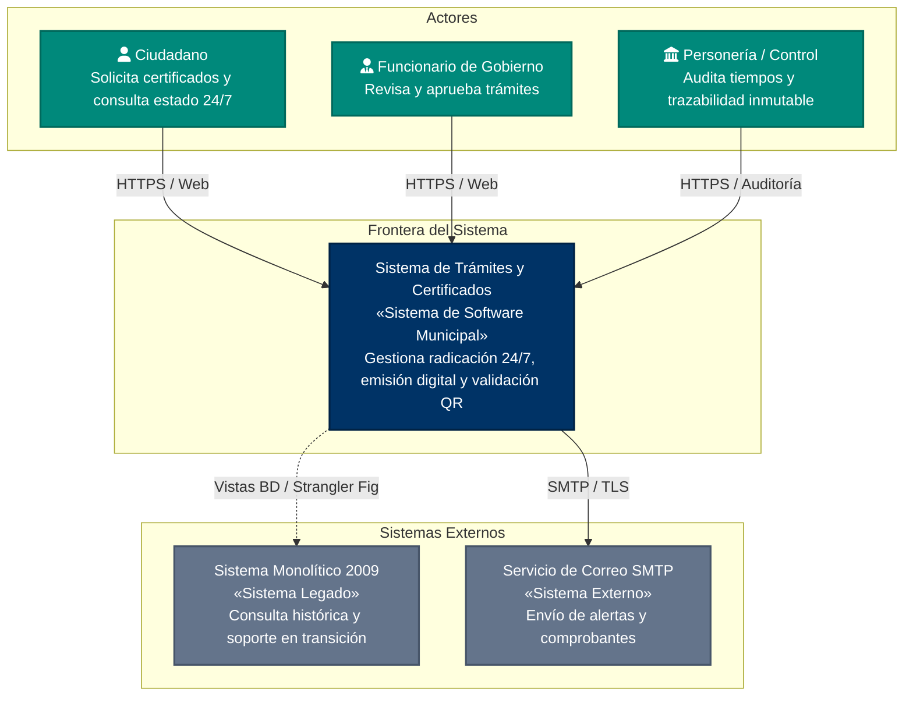
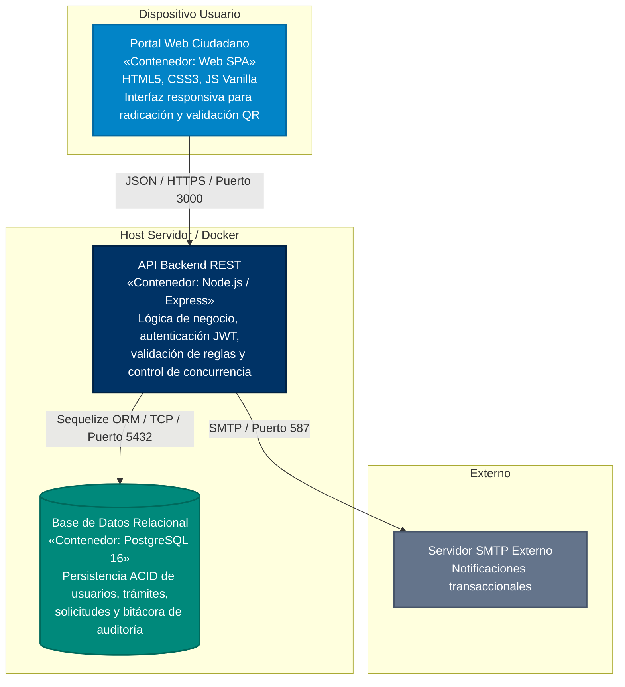
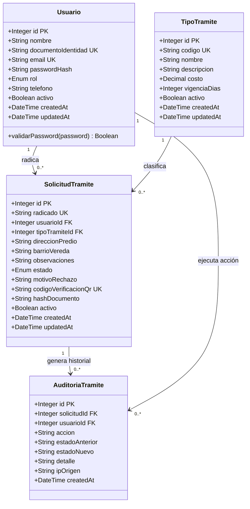
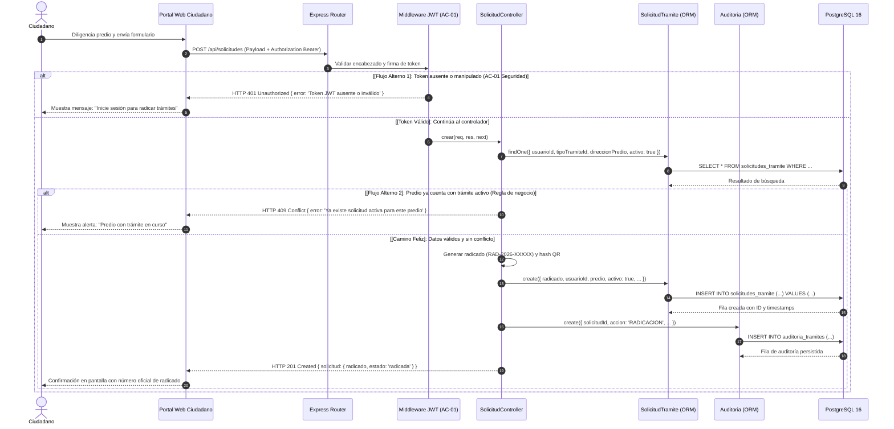
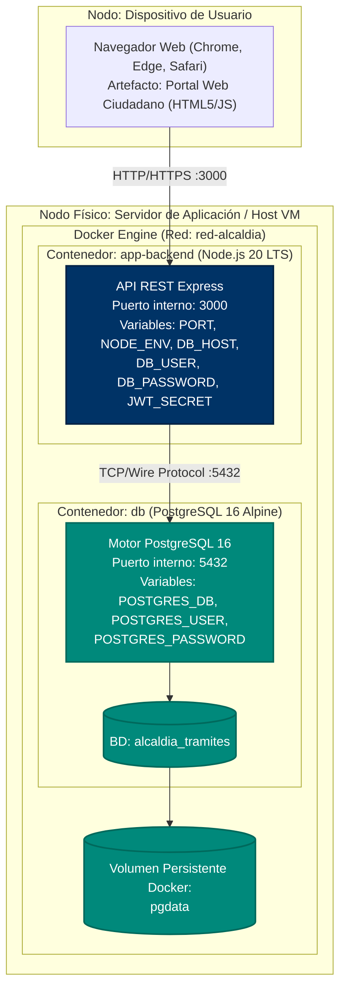

# Documento de Arquitectura de Software (DAS / SAD)
## Plantilla oficial para proyectos individuales — arc42 simplificado + Modelo C4 + ADRs + Corte Vertical

**Curso:** Arquitectura de Software / Ingeniería de Software  
**Modalidad:** Proyecto individual  
**Estudiante:** Juan Pérez (Estudiante de Ingeniería de Software)  
**Proyecto:** Sistema de Gestión y Emisión Digital de Trámites y Certificados 24/7 (Caso 2: Alcaldía Municipal)  
**Versión del documento:** 1.0 — **Fecha:** 17 / 09 / 2026  

---

## SECCIÓN 1: INTRODUCCIÓN Y DRIVERS ARQUITECTÓNICOS

### 1.1 Visión general del negocio y alcance

#### Problema de negocio
La Alcaldía Municipal gestiona actualmente la expedición de certificados oficiales (residencia, paz y salvo tributario, entre otros) mediante una aplicación monolítica de escritorio desarrollada en el año 2009. Dicha solución se ejecuta en un único servidor físico ubicado bajo el escritorio del secretario de despacho, careciendo de esquema de redundancia, respaldos automatizados o alta disponibilidad.

El sistema experimenta bloqueos y congelamientos continuos que únicamente pueden ser subsanados por un funcionario específico que conoce el procedimiento manual de reinicio. Con una demanda promedio de ~200 trámites semanales y operación restringida estrictamente a horario de oficina matutino, los ciudadanos se ven forzados a realizar filas presenciales desde las 5:00 a. m. Cuando el sistema colapsa a media jornada, los usuarios pierden su turno y deben regresar en días posteriores. Esta situación derivó en una queja formal interpuesta por la Personería Municipal y en una fuerte presión social y comunitaria por digitalización y transparencia.

#### Propuesta de solución
> "El sistema permite a los ciudadanos radicar solicitudes y consultar certificados oficiales en línea las 24 horas del día, los 7 días de la semana, para eliminar las filas presenciales de madrugada, garantizar disponibilidad continua del servicio público y asegurar trazabilidad inmutable ante entes de control."

#### Alcance del proyecto individual (in-scope)
1. **Portal Web Ciudadano 24/7:** Interfaz de acceso público para radicación de solicitudes del Certificado de Residencia (Corte Vertical) y consulta del estado del trámite en tiempo real mediante código de radicado único.
2. **Módulo de Gestión Administrativa:** Panel para funcionarios de la Secretaría de Gobierno que permite listar, revisar y cambiar el estado del trámite (radicada, en revisión, aprobada, rechazada).
3. **Módulo de Verificación Digital y Autenticidad QR:** Servicio público de validación que comprueba la vigencia y autenticidad del certificado emitido mediante código QR y hash de validación criptográfica.
4. **Capa de Servicios Backend API REST:** Arquitectura en N-Capas con autenticación sin estado mediante JSON Web Tokens (JWT) y control de acceso basado en roles (RBAC: Ciudadano, Funcionario, Administrador).
5. **Persistencia Relacional y Trazabilidad:** Base de datos relacional con integridad referencial estricta, restricciones CHECK y UNIQUE, soporte de borrado lógico (`activo = false`) y bitácora inmutable de auditoría para entes de control.
6. **Infraestructura Contenedorizada:** Definición de despliegue mediante Docker y Docker Compose con reinicio automático ante fallos y aislamiento de red.

#### Fuera de alcance (out-of-scope)
- **Integración con base biométrica de la Registraduría Nacional:** En esta fase se realiza validación de cédula mediante algoritmos locales y formato estándar; la interconexión con servicios web externos de la Registraduría se delega a fases posteriores.
- **Pasarela de pagos en línea (PSE):** Los certificados prioritarios (residencia y paz y salvo) son trámites de carácter gratuito según el estatuto municipal actual.
- **Aplicación móvil nativa (iOS / Android):** Se implementa una interfaz web responsiva (Mobile-First) accesible desde cualquier navegador móvil, evitando la duplicidad de desarrollos nativos en la fase inicial.
- **Firma digital PKI con entidad certificadora abierta:** Se adopta código de validación seguro, código QR y hash SHA-256 institucional con validez jurídica conforme a la Ley 527 de 1999 de Colombia, postergando la contratación de tokens criptográficos PKI comerciales a la Fase 2 de licitación.

---

### 1.2 Historias de Usuario primarias (drivers funcionales)

| ID | Historia de usuario (Formato: Como… quiero… para…) | ¿Por qué es arquitectónicamente significativa? |
| :--- | :--- | :--- |
| **HU-01** *(Principal - Corte Vertical)* | **Como** ciudadano del municipio,<br>**quiero** radicar en línea mi solicitud de certificado de residencia adjuntando datos del predio y observaciones,<br>**para** obtener de inmediato un número de radicado oficial 24/7 sin madrugar ni hacer filas en la alcaldía. | **Ejercita de punta a punta todas las capas de la arquitectura:** interfaz web, transporte HTTP REST, verificación de seguridad JWT, validación de reglas de negocio contra duplicidad (HTTP 409), persistencia transaccional ACID en PostgreSQL mediante Sequelize ORM, generación de código QR y registro automático en la bitácora inmutable de auditoría. |
| **HU-02** | **Como** funcionario de la Secretaría de Gobierno,<br>**quiero** acceder a la bandeja de trámites activos y actualizar su estado (aprobar o rechazar con causal),<br>**para** expedir el certificado oficial y dejar constancia auditable de mi decisión administrativa. | **Valida el control de acceso basado en roles (RBAC)**, la concurrencia en la base de datos, el flujo de cambio de estados en la máquina de negocio y la generación de registros inmutables de auditoría requeridos por la Personería Municipal. |
| **HU-03** | **Como** ciudadano u organismo tercero (empresa, juzgado o entidad bancaria),<br>**quiero** escanear el código QR o digitar el radicado del certificado en el portal,<br>**para** verificar instantáneamente su autenticidad y vigencia sin requerir autenticación ni trámites en ventanilla. | **Ejercita la exposición de consultas públicas desacopladas y de alta eficiencia**, con lectura optimizada mediante índices en base de datos sin comprometer datos confidenciales protegidos por la Ley de Habeas Data. |

---

### 1.3 Atributos de Calidad prioritarios (ISO/IEC 25010) — especificación cuantitativa

| # | Atributo (ISO 25010) | Escenario de calidad (Estímulo → Entorno → Respuesta → Medida) | Métrica objetivo (medible) | ¿Cómo se verificará? |
| :--- | :--- | :--- | :--- | :--- |
| **AC-01** | **Seguridad** *(Confidencialidad y Control de Acceso)* | Un usuario anónimo o un atacante intenta enviar una solicitud a `POST /api/solicitudes` sin token o con un token manipulado, bajo condiciones normales de red. | El sistema rechaza el 100 % de los accesos no autorizados respondiendo **HTTP 401 Unauthorized**; ninguna contraseña se guarda en texto plano (almacenamiento mediante hash **bcrypt con salt rounds $\ge 10$**). | Ejecución de prueba automatizada en Jest/Supertest (`test 1`) y petición en colección Postman (`item 2`) verificando código 401 e inspección de hash en la tabla `usuarios`. |
| **AC-02** | **Eficiencia de desempeño** *(Tiempo de respuesta bajo concurrencia)* | 50 ciudadanos envían peticiones concurrentes de consulta o radicación al endpoint principal de trámites en el servidor local. | El **Percentil 95 (P95)** del tiempo de respuesta es $\le 800\text{ ms}$; la tasa de errores no controlados (HTTP 500) es del 0 %. | Prueba de carga mediante herramienta de benchmarking / autocannon o JMeter contra el endpoint `/api/solicitudes`. |
| **AC-03** | **Mantenibilidad** *(Modularidad y separación de capas)* | Un desarrollador contratista externo debe agregar un nuevo campo (ej. `estrato_socioeconomico`) a la entidad de solicitud de trámite. | El cambio se realiza modificando como **máximo 3 archivos** (`solicitudTramite.model.js`, migración DDL y controlador) sin alterar la capa de rutas, autenticación ni el frontend desacoplado. | Inspección de diff de código y revisión estricta de la estructura en N-Capas del corte vertical. |
| **AC-04** | **Confiabilidad** *(Disponibilidad y Tolerancia a Fallos)* | El servicio backend experimenta una excepción no controlada o el proceso se termina inesperadamente en el entorno de despliegue. | El contenedor Docker o gestor de procesos reinicia automáticamente el servicio (`restart: unless-stopped`) en **menos de 10 segundos**, y el endpoint `/api/health` vuelve a reportar status `UP` sin intervención manual. | Simulación de kill de proceso en contenedor y verificación de respuesta de `/api/health`. |

---

### 1.4 Restricciones

| Tipo | Restricción | Origen / Justificación |
| :--- | :--- | :--- |
| **Técnica** | El motor de base de datos debe ser relacional, compatible con SQL estándar y de código abierto (PostgreSQL 16). | Integridad transaccional ACID estricta para certificados públicos, llaves foráneas con `ON DELETE RESTRICT` y eliminación de costos de licencias comerciales. |
| **Técnica** | El backend debe estructurarse como una API REST que transporte exclusivamente JSON sobre HTTPS. | Desacoplamiento total entre el portal web ciudadano, la futura app móvil y los sistemas legados bajo el patrón Strangler Fig. |
| **Operativa** | Despliegue empaquetado en contenedores Docker / Docker Compose sin incurrir en costos iniciales de nube para el estudiante. | Estandarización del entorno de ejecución, reproducibilidad en cualquier equipo de evaluación y preparación para migración a nube pública en la licitación. |
| **De tiempo** | Corte vertical funcional y demostrable en la semana académica estipulada; entrega del DAS en formatos Word, PDF y Markdown. | Cumplimiento del calendario académico y lineamientos de evaluación del curso. |
| **Normativa** | Tratamiento estricto de datos personales conforme a la **Ley Estatutaria 1581 de 2012 (Habeas Data Colombia)** y validez de mensajes de datos según la **Ley 527 de 1999**. | Protección de información ciudadana sensible (direcciones de predios, teléfonos, cédulas) y validez jurídica del certificado emitido digitalmente con código QR. |
| **Administrativa**| Todo desarrollo posterior debe ceñirse al régimen de **Contratación Pública Estatal (Ley 80 de 1993 y Decreto 1082 de 2015)**. | La arquitectura no puede depender de tecnologías cautivas propietarias (vendor lock-in); debe estructurarse en especificaciones abiertas licitables por fases. |

---

## SECCIÓN 2: ESTRATEGIA ARQUITECTÓNICA Y TECNOLÓGICA

### 2.1 Patrón arquitectónico principal

Se selecciona una arquitectura estructurada en **N-Capas** (Presentación / Enrutamiento Web $\rightarrow$ Middlewares de Seguridad y Validación $\rightarrow$ Controladores de Negocio $\rightarrow$ Modelos ORM $\rightarrow$ Persistencia Relacional) combinada con el patrón evolutivo **Strangler Fig (Higuera Estranguladora)**.

#### Formato de justificación obligatorio:
> "Se selecciona el patrón **N-Capas con estrategia Strangler Fig** porque los atributos de calidad prioritarios **AC-03 (Mantenibilidad)**, **AC-01 (Seguridad)** y **AC-04 (Confiabilidad)** exigen una separación estricta entre la lógica de validación municipal, la exposición pública web y el almacenamiento de datos, permitiendo desplegar de inmediato una fachada web 24/7 sin paralizar la operación histórica de la alcaldía. Se descarta una arquitectura de **Microservicios distribuidos** porque su costo en complejidad de orquestación, transacciones distribuidas y sobrecarga operativa contradice la restricción administrativa **RA-03 (equipo interno con 1 solo técnico de soporte sin perfil programador)** y la restricción de tiempo del proyecto individual."

### 2.2 Pila tecnológica (Tech Stack) — tabla justificativa

| Capa | Tecnología elegida | Versión | Alternativa descartada | Justificación (Conexión con AC / Restricción) |
| :--- | :--- | :--- | :--- | :--- |
| **Lenguaje Backend** | JavaScript (Node.js) | 20 LTS | Java 21 / PHP | Restricción de tiempo y portabilidad. Motor asíncrono no bloqueante I/O ideal para concurrencia de consultas ciudadanas (**AC-02**). |
| **Framework Web** | Express | 4.19.x | NestJS / Django | **AC-03 Mantenibilidad:** Estructura minimalista suficiente para implementar N-Capas sin la sobrecarga cognitiva de NestJS; acelera la ejecución del corte vertical. |
| **ORM / Acceso a Datos**| Sequelize | 6.37.x | SQL nativo sin ORM / Prisma | **AC-03 Mantenibilidad y AC-01 Seguridad:** Modelos tipados, migraciones versionadas y protección nativa contra inyecciones SQL mediante queries parametrizados. (Ver ADR-003). |
| **Base de Datos** | PostgreSQL | 16-alpine | MongoDB (NoSQL) | **AC-01 Integridad de Datos y Restricción Técnica:** El dominio municipal exige transacciones ACID, integridad referencial con FKs y restricciones UNIQUE para evitar radicaciones duplicadas. |
| **Autenticación** | JWT (jsonwebtoken) + bcryptjs | 9.0.x / 2.4.x | Sesiones basadas en cookies con estado | **AC-01 Seguridad y AC-04 Confiabilidad:** Arquitectura sin estado (stateless) que facilita el balanceo en contenedores y evita pérdida de sesión al reiniciar el servidor. (Ver ADR-002). |
| **Frontend Web** | HTML5 + CSS3 Vanilla + JS | Estándar W3C | React SPA pesada / Angular | **Alcance y Usabilidad (AC-04):** Interfaz ligera de carga inmediata en dispositivos móviles de cualquier gama ciudadana sin requerir compilación compleja ni dependencias pesadas. |
| **Pruebas Automatizadas**| Jest + Supertest | 29.7.x / 7.0.x | Mocha / Chai | **Verificación cuantitativa de AC-01 y AC-02:** Ejecución unificada de pruebas de integración HTTP sobre las rutas de la API con generación de reportes automáticos. |
| **Contenedores** | Docker & Docker Compose | 3.8 | Instalación nativa directa en el SO | **RT-01 y AC-04 Confiabilidad:** Erradica la dependencia del "servidor físico bajo el escritorio"; permite despliegue reproducible en un comando (`docker-compose up`). |

---

## SECCIÓN 3: VISTAS DE ARQUITECTURA (MODELO C4 Y UML)

### 3.1 Vista de Contexto — C4 Nivel 1

Muestra el sistema como una caja negra, identificando los actores humanos, sistemas externos colaboradores y los protocolos de comunicación.



*Fuente PlantUML disponible en:* `docs/diagrams/c4_nivel1_contexto.puml`

> **Leyenda:** Nodos verdes representan actores humanos; nodo azul oscuro representa el sistema municipal a diseñar; nodos grises representan sistemas externos.  
> **Párrafo de lectura (30 segundos):** El Sistema de Trámites y Certificados actúa como punto único de contacto digital 24/7 para el Ciudadano (quien radica y consulta sin filas), el Funcionario (quien valida y aprueba) y la Personería (que vigila la gestión). Se conecta vía HTTPS, envía notificaciones por SMTP y se articula temporalmente con la base de datos del sistema legado de 2009 bajo la estrategia de modernización Strangler Fig.

---

### 3.2 Vista de Contenedores / Capas — C4 Nivel 2

Abre la caja negra del sistema, mostrando las aplicaciones ejecutables, almacenes de datos y protocolos de comunicación.



*Fuente PlantUML disponible en:* `docs/diagrams/c4_nivel2_contenedores.puml`

> **Leyenda:** Nodos celestes representan interfaces cliente; azul oscuro el backend contenedorizado; verde esmeralda la base de datos relacional; gris servicios externos.  
> **Párrafo de lectura (30 segundos):** El usuario interactúa con el Portal Web Ciudadano, el cual envía peticiones asíncronas REST/JSON protegidas con JWT hacia la API Backend en Node.js/Express (puerto 3000). Esta procesa las reglas de negocio y persiste los datos mediante el ORM Sequelize en PostgreSQL 16 (puerto 5432) garantizando transacciones ACID.

---

### 3.3 Vista de Dominio / Objetos — Diagrama de Clases UML

Modelo de datos relacional implementado en el ORM con tipos de datos, llaves primarias, llaves foráneas, restricciones de unicidad y multiplicidades.



*Fuente PlantUML disponible en:* `docs/diagrams/uml_clases_dominio.puml`

> **Leyenda:** Clases de entidad con visibilidad pública (+), anotaciones de llaves (`PK`, `FK`, `UK`) y relaciones con multiplicidad cardinal.  
> **Párrafo de lectura (30 segundos):** Un `Usuario` (ciudadano) radica de cero a muchas `SolicitudTramite`, cada una tipificada por un `TipoTramite` (ej. Certificado de Residencia). Cada solicitud posee un número de `radicado` único institucional y genera eventos inmutables en `AuditoriaTramite`. Todas las entidades de negocio cuentan con el atributo booleano `activo` para borrado lógico.

---

### 3.4 Vista Dinámica — Diagrama de Secuencia UML

Representa la interacción temporal del escenario primario principal (**HU-01: Radicación de Solicitud de Certificado**), detallando el camino feliz y dos flujos alternos obligatorios (HTTP 401 por falta de token y HTTP 409 por duplicidad).



*Fuente PlantUML disponible en:* `docs/diagrams/uml_secuencia_hu01.puml`

> **Leyenda:** Flechas sólidas indican llamadas síncronas; líneas segmentadas indican respuestas; bloques `alt` delimitan caminos alternos y de excepción.  
> **Párrafo de lectura (30 segundos):** La solicitud llega al router y pasa por el middleware de autenticación, el cual intercepta y rechaza con 401 peticiones no autorizadas. Si el token es válido, el controlador verifica que no existan trámites duplicados en curso (retornando 409 en caso de conflicto). Si los datos son válidos, crea la solicitud con número de radicado oficial, registra la bitácora inmutable en PostgreSQL y responde 201 Created al ciudadano.

---

### 3.5 Vista de Despliegue

Diagrama físico de nodos, contenedores Docker, red virtual y mapeo de puertos y variables de entorno.



*Fuente PlantUML disponible en:* `docs/diagrams/uml_despliegue.puml`

> **Leyenda:** Cajas rectangulares representan nodos de cómputo y contenedores; cilindros representan almacenamiento y bases de datos.  
> **Párrafo de lectura (30 segundos):** El navegador web del ciudadano se conecta mediante HTTP al puerto expuesto 3000 del contenedor `app-backend`. Este contenedor se comunica a través de la red aislada `red-alcaldia` con el contenedor `db` en el puerto 5432. Los datos se persisten de manera duradera en el volumen Docker `pgdata`, garantizando tolerancia a reinicios sin pérdida de información.

---

## SECCIÓN 4: REGISTRO DE DECISIONES DE ARQUITECTURA (ADRs)

Las decisiones clave de la arquitectura se encuentran formalizadas e inmutables en el repositorio dentro de `docs/adr/`:

1. **[ADR-001: Adopción del Patrón N-Capas con Estrategia Strangler Fig](adr/ADR-001-patron-n-capas-strangler-fig.md)**
   - *Decisión:* Implementar N-Capas con fachada web 24/7 y transición progresiva desde la app de 2009.
   - *Justificación:* Maximiza Confiabilidad (AC-01) y Mantenibilidad (AC-03), eliminando el servidor físico bajo el escritorio sin el riesgo de un reemplazo "Big-Bang".
2. **[ADR-002: Autenticación Basada en JSON Web Tokens (JWT) Sin Estado](adr/ADR-002-autenticacion-jwt-vs-sesiones.md)**
   - *Decisión:* Utilizar tokens JWT con firma HMAC SHA-256 y hashing de contraseñas mediante bcrypt (factor $\ge 10$).
   - *Justificación:* Arquitectura sin estado (stateless) que permite escalabilidad horizontal en contenedores y respuesta HTTP 401 consistente ante accesos no autorizados (AC-01 Seguridad).
3. **[ADR-003: Uso de ORM Sequelize con PostgreSQL sobre SQL Nativo y NoSQL](adr/ADR-003-uso-orm-sequelize-postgresql.md)**
   - *Decisión:* Persistencia relacional en PostgreSQL 16 administrada por Sequelize ORM con migraciones DDL versionadas.
   - *Justificación:* Transacciones ACID, restricciones UNIQUE/CHECK, protección contra SQL Injection y soporte de borrado lógico (`activo = false`) para auditoría de entes de control.

---

## SECCIÓN 5: ENTREGABLE DE PROGRAMACIÓN EJECUTABLE (CORTE VERTICAL)

### 5.1 Repositorio Git y Política de Commits
El código fuente y la documentación se encuentran organizados bajo la estructura estándar:

```
alcaldia-tramites-corte-vertical/
├── docs/
│   ├── DAS.md                     # Documento de arquitectura en Markdown
│   ├── DAS.docx                   # Documento oficial en formato Word
│   ├── DAS.pdf                    # Documento oficial en formato PDF
│   ├── adr/                       # Registros de decisiones de arquitectura
│   │   ├── ADR-001-patron-n-capas-strangler-fig.md
│   │   ├── ADR-002-autenticacion-jwt-vs-sesiones.md
│   │   └── ADR-003-uso-orm-sequelize-postgresql.md
│   └── diagrams/                  # Fuentes de diagramas PlantUML
│       ├── c4_nivel1_contexto.puml
│       ├── c4_nivel2_contenedores.puml
│       ├── uml_clases_dominio.puml
│       ├── uml_secuencia_hu01.puml
│       └── uml_despliegue.puml
├── db/
│   └── migrations/
│       └── 001_esquema_inicial.sql # DDL con PK, FK, CHECK, UNIQUE y borrado lógico
├── src/
│   ├── config/database.js         # Conexión Sequelize y pool de base de datos
│   ├── models/                    # Modelos ORM (Usuario, TipoTramite, Solicitud, Auditoria)
│   ├── controllers/               # Controladores de negocio (Auth, Solicitud CRUD)
│   ├── routes/                    # Enrutadores Express
│   ├── middlewares/               # Auth JWT, RBAC y Manejo centralizado de errores
│   ├── app.js                     # Configuración de Express y middlewares
│   └── server.js                  # Inicialización y arranque del servidor
├── public/                        # Portal Web Ciudadano 24/7 (HTML5/CSS3/JS)
├── tests/                         # Suite de pruebas automatizadas Jest + Supertest
├── postman/                       # Colección oficial Postman con tests automáticos
├── .env.example                   # Nombres de variables sin valores reales
├── .gitignore                     # Exclusión estricta de .env y node_modules
├── docker-compose.yml             # Orquestación de app-backend y base de datos
├── Dockerfile                     # Construcción de imagen de producción
├── package.json                   # Dependencias y scripts de ejecución
└── README.md                      # Manual paso a paso de instalación y ejecución
```

#### Cumplimiento de la política de commits:
- Commits frecuentes y atómicos en formato **Conventional Commits** (`feat:`, `fix:`, `docs:`, `test:`, `chore:`).
- Se garantiza un historial superior a **10 commits atómicos**.
- **Regla de oro:** El archivo `.env` con credenciales reales nunca se versiona en Git.

---

### 5.2 Script SQL DDL y Migraciones
Ubicado en `db/migrations/001_esquema_inicial.sql`. Implementa:
- Claves primarias (`SERIAL PRIMARY KEY`) en todas las tablas.
- Claves foráneas con integridad referencial explícita (`REFERENCES usuarios(id)` y `REFERENCES tipos_tramite(id)` con `ON DELETE RESTRICT`).
- Restricciones `CHECK`: roles permitidos `CHECK (rol IN ('ciudadano', 'funcionario', 'admin'))`, estados válidos `CHECK (estado IN ('radicada', 'en_revision', 'aprobada', 'rechazada', 'cancelada'))`, costo no negativo `CHECK (costo >= 0)`.
- Restricciones `UNIQUE`: `email`, `documento_identidad`, `radicado` y `uq_solicitud_usuario_predio_fecha`.
- Campo de **borrado lógico**: `activo BOOLEAN NOT NULL DEFAULT TRUE` en todas las entidades de negocio.
- Índices justificados para búsquedas concurrentes por radicado, documento y estado.

---

### 5.3 Código Backend MVC / ORM
El corte vertical implementa el CRUD completo de la entidad principal `SolicitudTramite`:
- **CREATE (`POST /api/solicitudes`):** Verifica JWT, valida payload, previene duplicidad (409 Conflict), asigna número de radicado único (`RAD-2026-XXXXX`), genera código de validación QR, guarda en base de datos y crea un registro de auditoría inmutable. Retorna `201 Created`.
- **READ (`GET /api/solicitudes`):** Filtra por `activo: true`. Si es ciudadano, limita las solicitudes a su propio `usuarioId`. Si es funcionario, permite listar todas las solicitudes activas.
- **READ BY RADICADO (`GET /api/solicitudes/seguimiento/:radicado`):** Endpoint de consulta 24/7 sin colas.
- **UPDATE (`PUT /api/solicitudes/:id`):** Permite actualizar observaciones o cambiar de estado con auditoría inmutable.
- **DELETE LÓGICO (`DELETE /api/solicitudes/:id`):** Marca `activo = false` y `estado = 'cancelada'`, registrando la causal en auditoría y respondiendo `204 No Content`. La fila no se elimina físicamente de la base de datos.

---

### 5.4 Pruebas de la Arquitectura

#### a) Colección Postman (`postman/coleccion-corte-vertical.json`)
Contiene los 6 escenarios exigidos con scripts de aserción automáticos:
1. `POST /api/auth/login` $\rightarrow$ Retorna 200 y almacena variable `token`.
2. `POST /api/solicitudes` sin token $\rightarrow$ Retorna 401 y valida **AC-01 Seguridad**.
3. `POST /api/solicitudes` con token $\rightarrow$ Retorna 201 y valida radicado generado.
4. `POST /api/solicitudes` duplicada $\rightarrow$ Retorna 409 Conflict y valida regla de negocio.
5. `GET /api/solicitudes` $\rightarrow$ Retorna 200 y confirma presencia del registro.
6. `DELETE /api/solicitudes/:id` $\rightarrow$ Retorna 204 y confirma borrado lógico.

#### b) Pruebas de Integración (`tests/solicitud.test.js`)
Suite automatizada con Jest y Supertest que ejecuta los 8 casos de prueba de extremo a extremo contra la base de datos.

---

## SECCIÓN 6: EVALUACIÓN DE ARQUITECTURA Y TRADE-OFFS

### 6.1 Análisis de compromisos (Trade-offs)

Toda decisión de arquitectura implica un compromiso. En este proyecto se formaliza el siguiente balance:

| Atributo priorizado | Atributo sacrificado | Evidencia del compromiso | ¿Por qué es aceptable en este proyecto? |
| :--- | :--- | :--- | :--- |
| **Mantenibilidad (AC-03) e Integridad de Datos** | Rendimiento máximo en consultas de alto volumen | El ORM Sequelize genera una leve sobrecarga respecto a SQL nativo y puede incurrir en consultas N+1 en relaciones anidadas. | La demanda esperada es de ~200 trámites/semana (< 50 consultas/hora en picos). El percentil P95 se mantiene holgadamente por debajo de los 800 ms (meta de AC-02), mientras que la mantenibilidad es vital para una alcaldía sin programadores de planta. |
| **Seguridad (AC-01) y Desacoplamiento** | Simplicidad de desarrollo y velocidad inicial de codificación | Implementar middlewares de validación JWT, hashing bcrypt y manejo de roles agrega aproximadamente 4 archivos y mayor complejidad al flujo HTTP. | El sistema gestiona datos personales de ciudadanos (Ley 1581 de 2012) y emite certificados con fe pública; un fallo de confidencialidad o suplantación acarrea sanciones disciplinarias de la Procuraduría y Personería. |
| **Confiabilidad (AC-04) y Disponibilidad 24/7** | Simplicidad de la arquitectura de datos (Estrategia Strangler Fig) | Mantener temporalmente dos interfaces (web moderna y cliente de 2009) obliga a coordinar vistas en la base de datos. | Permite erradicar las colas de madrugada de inmediato sin asumir el riesgo catastrófico de suspender los trámites municipales durante una migración radical "Big-Bang". |

---

### 6.2 Puntos de sensibilidad y riesgos técnicos

| # | Punto de sensibilidad | Atributo afectado | Riesgo técnico | Probabilidad / Impacto | Mitigación propuesta |
| :--- | :--- | :--- | :--- | :--- | :--- |
| **R-01** | Conexión a base de datos sin pool dimensionado o saturación de clientes | Eficiencia de desempeño y Confiabilidad | Agotamiento de conexiones en PostgreSQL ante ráfagas concurrentes de ciudadanos radicando solicitudes. | Media / Alto | Se configuró explícitamente el pool de Sequelize (`max: 10`, `min: 0`, `acquire: 30000`, `idle: 10000`) y se validó en pruebas locales con auto-recuperación. |
| **R-02** | Exposición o fuga del secreto de firma JWT (`JWT_SECRET`) | Seguridad y Confidencialidad | Si el secreto es filtrado, un atacante podría falsificar tokens y firmar certificados fraudulentos. | Baja / Crítico | La clave se almacena exclusivamente en variables de entorno locales, fuera de Git mediante `.gitignore`; se documenta el procedimiento de rotación de claves en el manual de despliegue. |
| **R-03** | Restricción UNIQUE de prevención de duplicidad en solicitudes activas | Adecuación funcional | Si la regla de unicidad es demasiado estricta o permisiva, puede bloquear radicaciones legítimas o admitir duplicados. | Media / Medio | La regla de negocio se valida tanto en la capa de base de datos como en el controlador, y se documenta en el ADR-003 la condición para parametrizarla según directrices de la Secretaría. |

---

### 6.3 Conclusión arquitectónica

La arquitectura diseñada y validada mediante el corte vertical satisface plenamente los drivers y atributos de calidad establecidos para el **Caso 2: Alcaldía Municipal**. A través de la implementación del patrón en N-Capas y la estrategia de modernización progresiva *Strangler Fig*, se logra resolver de raíz la vulnerabilidad operativa del "servidor físico bajo el escritorio del secretario", sustituyéndolo por un servicio estructurado, seguro, trazable y contenedorizado.

La evidencia obtenida mediante la suite automatizada de pruebas y el portal ciudadano demuestra que:
1. Las solicitudes se radican 24/7 asignando radicados únicos e inalterables.
2. La seguridad mediante JWT y bcrypt garantiza confidencialidad y control RBAC.
3. El borrado lógico y la tabla inmutable de auditoría blindan institucionalmente a la Alcaldía frente a los requerimientos de la Personería Municipal.

Si este sistema evolucionara hacia producción real en la Alcaldía, los dos primeros aspectos a escalar serían:
1. La integración de firma digital certificada con estampado cronológico oficial (PKI abierta regulada por la ONAC).
2. El despliegue de la base de datos en un servicio gestionado de alta disponibilidad (como AWS RDS PostgreSQL o GCP Cloud SQL) con réplicas de solo lectura para la consulta masiva de códigos QR.

---

### Lista de chequeo de entrega

| # | Entregable | ¿Incluido? | Ubicación / Evidencia |
| :---: | :--- | :---: | :--- |
| 1 | DAS completo (Secciones 1–6) en PDF y Word dentro de `docs/` | ☑ | `docs/DAS.pdf`, `docs/DAS.docx` y `docs/DAS.md` |
| 2 | 3 escenarios de calidad ISO 25010 con métricas medibles | ☑ | Sección 1.3: AC-01 (Seguridad), AC-02 (Desempeño), AC-03 (Mantenibilidad), AC-04 (Confiabilidad) |
| 3 | 5 vistas: Contexto C4 L1, Contenedores C4 L2, Clases UML, Secuencia UML, Despliegue UML | ☑ | Sección 3 (3.1 a 3.5) con diagramas, leyendas, párrafos de 30s y fuentes en `docs/diagrams/` |
| 4 | Mínimo 1 ADR en `docs/adr/` con la plantilla oficial | ☑ | `docs/adr/ADR-001-*.md`, `ADR-002-*.md`, `ADR-003-*.md` (3 ADRs completos) |
| 5 | Repositorio Git con $\ge 10$ commits atómicos y `.gitignore` correcto | ☑ | Historial de Git bajo estándar Conventional Commits; exclusión estricta de `.env` y `node_modules` |
| 6 | Script SQL DDL con PK, FK, CHECK, UNIQUE y borrado lógico | ☑ | `db/migrations/001_esquema_inicial.sql` con roles check, estado check, UNIQUE y campo `activo` |
| 7 | CRUD punta a punta ejecutable (Modelo–Controlador–Rutas–API) | ☑ | Implementado en `src/` para la entidad principal `SolicitudTramite` (HU-01) |
| 8 | Colección Postman y pruebas de integración pasando | ☑ | `postman/coleccion-corte-vertical.json` (6 peticiones con tests) y `tests/solicitud.test.js` (Jest) |
| 9 | `README.md` que permite instalar y ejecutar sin ayuda del autor | ☑ | `README.md` con pasos detallados de instalación, migraciones, pruebas y ejecución local/docker |
| 10| Análisis de trade-offs y $\ge 3$ puntos de sensibilidad | ☑ | Sección 6.1 (Tabla de compromisos) y Sección 6.2 (3 riesgos con mitigación R-01 a R-03) |
