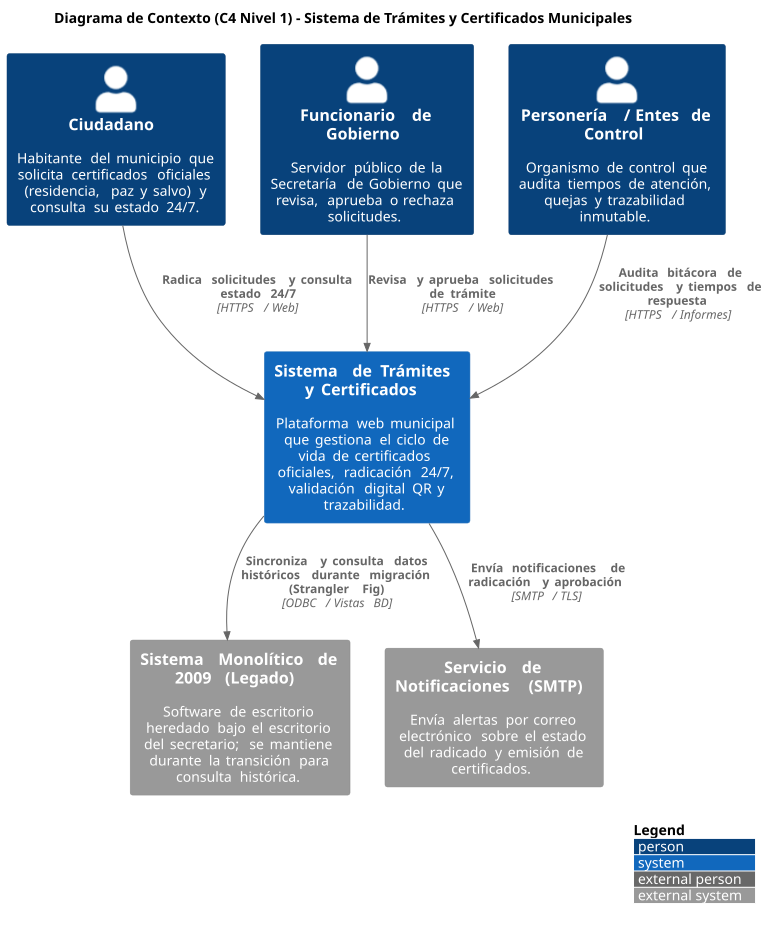
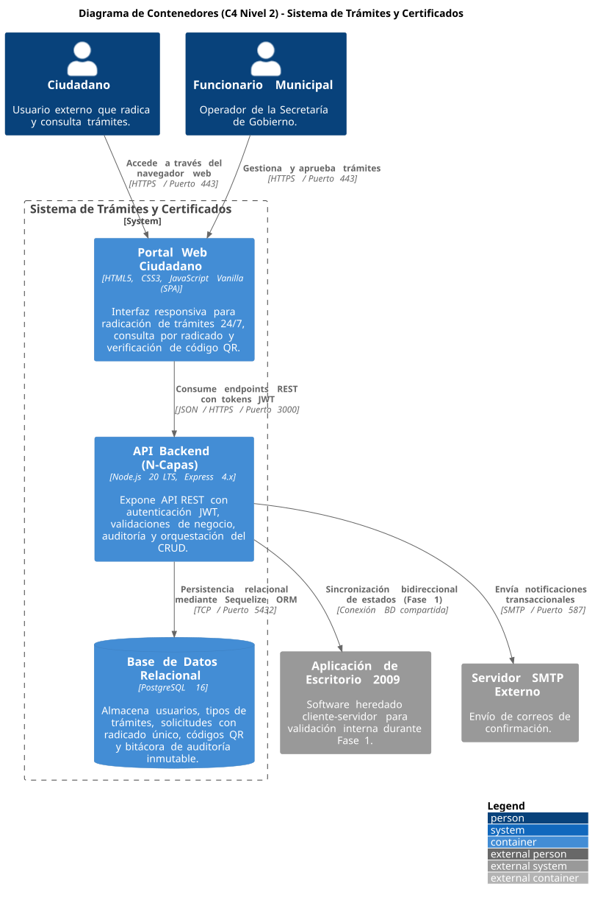
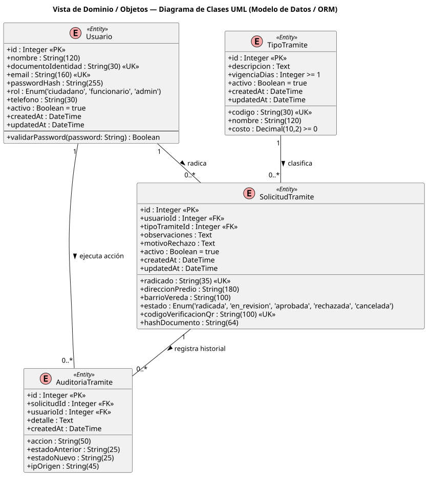
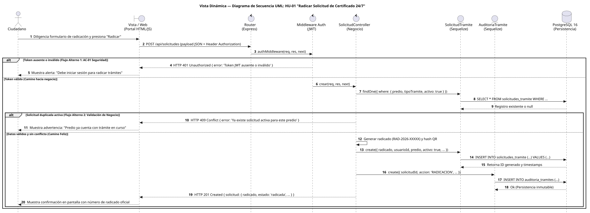
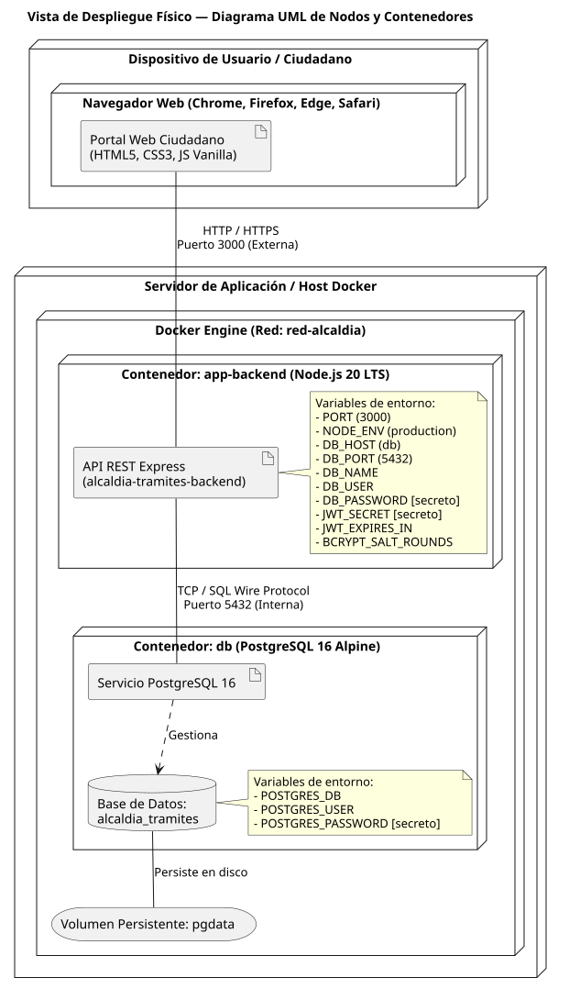

# Diagramas de Arquitectura de Software

Este directorio contiene las representaciones visuales y modelos formales de arquitectura para el **Sistema de Gestión y Emisión Digital de Trámites y Certificados 24/7 (Alcaldía Municipal)**.

Todos los diagramas cuentan con:
1. **Renderizado visual vectorial e imagen:** Archivos `.svg` y `.png` visibles directamente en GitHub.
2. **Código fuente ejecutable:** Archivos `.puml` (PlantUML) y bloques interactivos Mermaid.
3. **Tableros interactivos:** Enlaces directos a **Lucidchart** para edición y navegación.

---

## 📌 Tabla General de Diagramas y Recursos

| # | Diagrama | Tipo / Nivel | Imagen Vectorial | Imagen PNG | Fuente PUML | Tablero en Línea |
|---|----------|--------------|------------------|------------|-------------|------------------|
| 1 | **Contexto del Sistema** | C4 Nivel 1 | [c4_nivel1_contexto.svg](c4_nivel1_contexto.svg) | [c4_nivel1_contexto.png](c4_nivel1_contexto.png) | [c4_nivel1_contexto.puml](c4_nivel1_contexto.puml) | *(En edición)* |
| 2 | **Contenedores y Capas** | C4 Nivel 2 | [c4_nivel2_contenedores.svg](c4_nivel2_contenedores.svg) | [c4_nivel2_contenedores.png](c4_nivel2_contenedores.png) | [c4_nivel2_contenedores.puml](c4_nivel2_contenedores.puml) | *(En edición)* |
| 3 | **Clases del Dominio** | UML Estructural | [uml_clases_dominio.svg](uml_clases_dominio.svg) | [uml_clases_dominio.png](uml_clases_dominio.png) | [uml_clases_dominio.puml](uml_clases_dominio.puml) | *(En edición)* |
| 4 | **Secuencia HU-01 (Corte Vertical)** | UML Dinámico | [uml_secuencia_hu01.svg](uml_secuencia_hu01.svg) | [uml_secuencia_hu01.png](uml_secuencia_hu01.png) | [uml_secuencia_hu01.puml](uml_secuencia_hu01.puml) | [🔗 Ver en Lucidchart](https://lucid.app/lucidchart/84fc9272-7cf2-46e7-b704-865ca83fc88f/edit?viewport_loc=-902%2C-522%2C2747%2C1540%2C0_0&invitationId=inv_bef8d021-b763-4f34-95da-ca8f4055b91c) |
| 5 | **Despliegue e Infraestructura** | UML Despliegue | [uml_despliegue.svg](uml_despliegue.svg) | [uml_despliegue.png](uml_despliegue.png) | [uml_despliegue.puml](uml_despliegue.puml) | *(En edición)* |

---

## 1. Diagrama de Contexto (C4 Nivel 1)

Muestra los límites del sistema, los usuarios principales (Ciudadano, Funcionario, Personería) y las interacciones con sistemas externos (Sistema legado de 2009 y Servicio SMTP).

- **Formatos disponibles:** [Vectorial SVG](c4_nivel1_contexto.svg) | [Imagen PNG](c4_nivel1_contexto.png) | [Código PlantUML](c4_nivel1_contexto.puml)

---

## 2. Diagrama de Contenedores y Capas (C4 Nivel 2)

Detalla la arquitectura de software interna: Portal Web Ciudadano (HTML5/JS), API Backend en Node.js/Express, Base de Datos PostgreSQL 16 y Servicio SMTP externo.

- **Formatos disponibles:** [Vectorial SVG](c4_nivel2_contenedores.svg) | [Imagen PNG](c4_nivel2_contenedores.png) | [Código PlantUML](c4_nivel2_contenedores.puml)

---

## 3. Diagrama de Clases del Dominio (UML)

Modelo de datos relacional y clases ORM: `Usuario`, `TipoTramite`, `SolicitudTramite` y `AuditoriaTramite`, con tipos, llaves (`PK`, `FK`, `UK`), restricciones y relaciones.

- **Formatos disponibles:** [Vectorial SVG](uml_clases_dominio.svg) | [Imagen PNG](uml_clases_dominio.png) | [Código PlantUML](uml_clases_dominio.puml)

---

## 4. Diagrama de Secuencia: HU-01 Radicación 24/7 (UML)

Interacción temporal de la historia de usuario principal del corte vertical, ilustrando el camino feliz y dos flujos alternos obligatorios (HTTP 401 por token inválido y HTTP 409 por conflicto de duplicidad).

> 🔗 **Tablero interactivo:** [Abrir en Lucidchart](https://lucid.app/lucidchart/84fc9272-7cf2-46e7-b704-865ca83fc88f/edit?viewport_loc=-902%2C-522%2C2747%2C1540%2C0_0&invitationId=inv_bef8d021-b763-4f34-95da-ca8f4055b91c)

- **Formatos disponibles:** [Vectorial SVG](uml_secuencia_hu01.svg) | [Imagen PNG](uml_secuencia_hu01.png) | [Código PlantUML](uml_secuencia_hu01.puml) | [Lucidchart](https://lucid.app/lucidchart/84fc9272-7cf2-46e7-b704-865ca83fc88f/edit?viewport_loc=-902%2C-522%2C2747%2C1540%2C0_0&invitationId=inv_bef8d021-b763-4f34-95da-ca8f4055b91c)

---

## 5. Diagrama de Despliegue e Infraestructura (UML)

Mapeo de la solución en contenedores Docker (`app-backend`, `db`), red virtual interna aislada (`red-alcaldia`), puertos expuestos (`3000`, `5432`) y volumen persistente (`pgdata`).

- **Formatos disponibles:** [Vectorial SVG](uml_despliegue.svg) | [Imagen PNG](uml_despliegue.png) | [Código PlantUML](uml_despliegue.puml)
